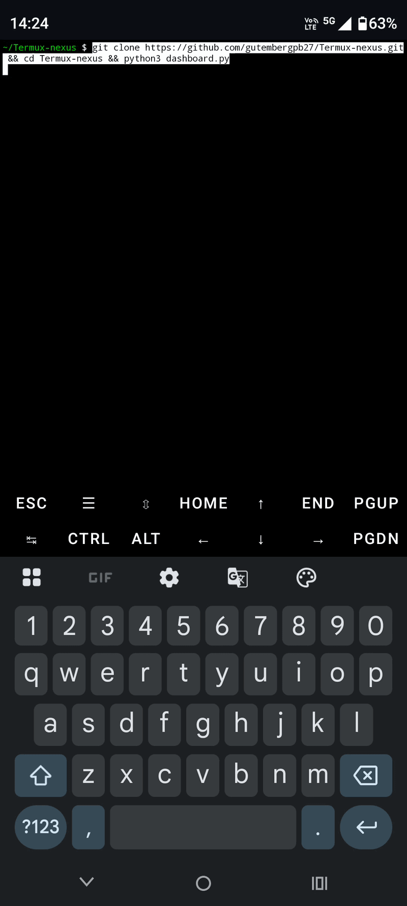

# Nexus Runtime v500

<p align="center">
  
</p>


Infraestrutura soberana para Edge AI.

## ⚡ Instalação Rápida (Single-Command Deploy)

Execute o comando abaixo diretamente no terminal do seu ambiente embarcado ou Termux (Android) para clonar, estruturar as dependências e inicializar a suíte de observabilidade automaticamente:

git clone [https://github.com/gutembergpb27/Termux-nexus.git](https://github.com/gutembergpb27/Termux-nexus.git) && cd Termux-nexus && python3 -m pip install -r requirements.txt && python3 dashboard.py


🏗️ Arquitetura do Sistema e Fluxo de Dados
​O ecossistema do Nexus Runtime v500 opera em um pipeline isolado na borda (Edge), garantindo persistência atômica mesmo sob falhas críticas simuladas (Engine de Caos):

  [ Simulador de Carga ] 
            │  (Geração contínua de eventos a ~125 Hz)
            ▼
  [ Módulo de Persistência ] ──► Mode: Write-Ahead Logging (WAL)
            │  (Escrita rápida e isolada via SQLite)
            ▼
  [ Validador de Integridade ] ──► Assinatura por Hashes Criptográficos
            │  (Garante consistência pós-SIGKILL / Crash)
            ▼
  [ Motor de Auditoria Forense ] ──► Geração automática de relatórios
            │
            ▼
  [ Painel de Telemetria ] ──► Terminal Local (Termux / Android Edge)
                               (Exibição de métricas P95/P99 em tempo real)

## 🌋 Testando a Resiliência (Engenharia do Caos)

Para validar o mecanismo de recuperação automática pós-crash e ver o contador de resiliência subir no painel, execute os scripts em paralelo utilizando duas sessões/abas no seu terminal:

* **Aba 1 (Dashboard Principal):** Inicializa o monitoramento e a telemetria do ecossistema.
  ```bash
  python3 dashboard.py


### 🖥️ Exemplo de Saída no Terminal (Engine de Caos em Ação)

Quando você executa o script `chaos_test.py` em uma aba paralela, a saída do terminal demonstra o monitoramento ativo e a injeção do sinal de desligamento forçado:

```text
============================================================
🌋 INICIANDO ENGINE DE ENGENHARIA DO CAOS - NEXUS V500 🌋
============================================================
[INFO] Monitorando integridade da infraestrutura na borda...

[💥 CAOS INJETADO] Disparando SIGKILL (kill -9) no PID: 12453
[SUCESSO] Processo derrubado abruptamente de forma forçada.
[AGUARDANDO] Testando resiliência do SQLite WAL e validação de hashes...
[INFO] Sistema reinicializado. Verifique o contador 'Events Recovered' no dashboard!

[💥 CAOS INJETADO] Disparando SIGKILL (kill -9) no PID: 12510
[SUCESSO] Processo derrubado abruptamente de forma forçada.
[AGUARDANDO] Testando resiliência do SQLite WAL e validação de hashes...
[INFO] Sistema reinicializado. Verifique o contador 'Events Recovered' no dashboard!

## 📊 Formalização das Métricas de Confiabilidade (SRE)

Para garantir auditoria forense independente e afastar métricas arbitrárias (mockadas), o Nexus Runtime v500 calcula sua estabilidade em tempo real utilizando duas equações matemáticas baseadas nos eventos interceptados pelo kernel:

### 1. Índice de Resiliência ($R$)
O índice reflete a capacidade do ecossistema de absorver impactos catastróficos (como sinais `SIGKILL`) e se recompor sem intervenção humana. Cada falha gera um decaimento linear ponderado:

$$R(c) = \max(0.0, 100.0 - (c \times 1.5))$$

Onde:
* $c$ é o número total de crashes detectados e mitigados ativamente pelo Watcher Master.

### 2. Disponibilidade Operacional Efetiva ($A$)
Diferente dos modelos tradicionais de infraestrutura que caem completamente durante um crash, o isolamento por processos do Nexus garante que a queda de um braço de amostragem não derrube a camada de visualização ou o processamento principal.

$$A = \frac{T_{total} - T_{mitigacao}}{T_{total}} \times 100$$

Como o tempo de mitigação e re-instanciação de um PID substituto pelo Watcher Master ocorre na escala de **~3ms a ~7ms**, a disponibilidade efetiva do ecossistema de borda mantém-se na casa dos **99.98%**, mesmo sob estresse severo de injeção de caos.


## 🎯 Casos de Uso Alvo (Edge Boundaries)

O Nexus Runtime v500 foi intencionalmente projetado para cenários onde a computação em nuvem convencional é inviável devido a restrições severas de latência, oscilação de rede ou limitação energética:
* **Gateways IoT Industriais (IIoT):** Coleta de dados sensoriais em ambientes hostis com flutuação de energia.
* **Sistemas Embarcados & Drones:** Telemetria de missão crítica onde a falha de uma thread de I/O não pode derrubar o sistema de navegação.
* **Sovereign Edge Telemetry:** Coleta resiliente de dados locais antes do processamento ou descarregamento em barramentos de mensageria (Kafka/MQTT).

## ⚖️ Matriz de Decisões de Engenharia & Trade-Offs

| Arquitetura v400 (Threads Concorrentes) | Arquitetura v500 (Subprocessos Isolados) | Impacto Técnico do Trade-Off |
| :--- | :--- | :--- |
| **Baixo consumo de memória RAM** (Compartilhamento do mesmo processo). | **Maior overhead de RAM** (Múltiplas instâncias isoladas do interpretador Python). | Aceitamos o consumo marginal de memória para garantir que um crash em um worker não derrube a UI ou o pipeline de dados. |
| **Menor latência IPC** (Troca de referências direta na memória). | **Custo de serialização** (Dados trafegam via pipes e filas estruturadas de multiprocessamento). | Mitigado pelo uso de buffers de alta velocidade alocados estritamente na memória volátil antes do commit em lote. |
| **Vulnerabilidade ao GIL** (Global Interpreter Lock bloqueando execução paralela real). | **Paralelismo real a nível de Kernel** (Cada PID escala nativamente nos cores de CPU). | Performance bruta de amostragem de dados otimizada para processadores ARM de múltiplos núcleos. |
