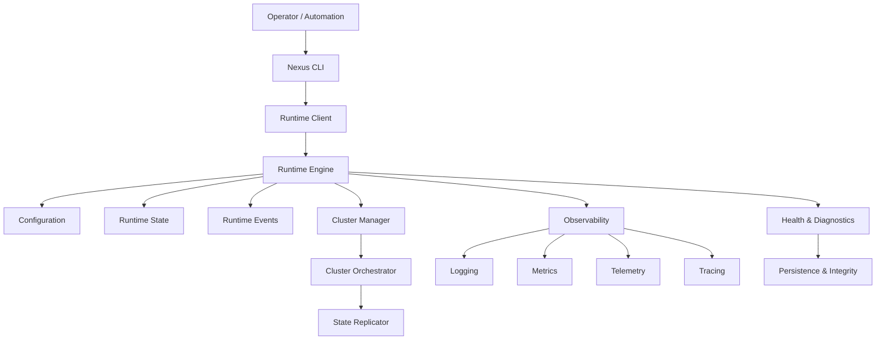
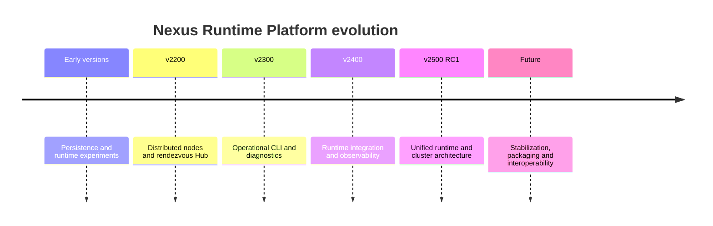

<div align="center">

# Nexus Runtime Platform

### Distributed runtime infrastructure for resilient systems

**Runtime · Cluster · Replication · Diagnostics · Observability**


</div>

---

## Overview

Nexus Runtime Platform is an experimental distributed runtime designed for
research, validation and development of resilient computing infrastructure.

The platform combines runtime lifecycle management, cluster orchestration,
state replication, diagnostics, health inspection and observability through
a modular Python architecture.

> Current release: **v2500.0.0rc1**

---

## Core capabilities

| Area | Capabilities |
|---|---|
| Runtime | Engine, configuration, state and events |
| Cluster | Node management, orchestration and replication |
| Diagnostics | Local environment and remote runtime inspection |
| Health | Runtime and storage-integrity checks |
| Observability | Logging, metrics, telemetry and tracing |
| CLI | Version, doctor, status, peers and cluster commands |
| Integration | Runtime client and HTTP endpoint client |
| Validation | Automated regression and cross-platform tests |

---

## Architecture


```mermaid
flowchart TD
    OPERATOR["Operator / Automation"] --> CLI["Nexus CLI"]

    CLI --> CLIENT["Runtime Client"]
    CLIENT --> ENGINE["Runtime Engine"]

    ENGINE --> CONFIG["Configuration"]
    ENGINE --> STATE["Runtime State"]
    ENGINE --> EVENTS["Runtime Events"]

    ENGINE --> CLUSTER["Cluster Manager"]
    CLUSTER --> ORCHESTRATOR["Cluster Orchestrator"]
    ORCHESTRATOR --> REPLICATOR["State Replicator"]

    ENGINE --> HEALTH["Health & Diagnostics"]
    ENGINE --> OBSERVABILITY["Observability"]

    OBSERVABILITY --> LOGGING["Logging"]
    OBSERVABILITY --> METRICS["Metrics"]
    OBSERVABILITY --> TELEMETRY["Telemetry"]
    OBSERVABILITY --> TRACING["Tracing"]

    HEALTH --> STORAGE["Persistence & Integrity"]
```

The architecture is divided into independent layers so runtime, cluster,
diagnostic and observability components can evolve without requiring a
monolithic implementation.

---

## Command-line interface

The `nexus` command provides a unified operational interface.

```text
usage: nexus [-h] {version,status,peers,cluster,doctor} ...

Nexus Runtime Platform CLI
```

Available commands:

| Command | Purpose |
|---|---|
| `nexus version` | Display the installed platform version |
| `nexus doctor` | Diagnose the local environment or a remote runtime |
| `nexus status` | Query the state of a Nexus node |
| `nexus peers` | List peers registered in the Hub |
| `nexus cluster` | Display the cluster summary |

These commands correspond to the CLI currently exposed by the project.

### Version

```powershell
nexus version
```

```text
Nexus Runtime Platform v2500.0.0rc1
```

### Local diagnostics

```powershell
nexus doctor
```

The doctor command reports:

- CLI and Python versions;
- operating-system information;
- Python executable;
- working-directory permissions;
- optional runtime connectivity;
- runtime health;
- storage integrity;
- cluster leadership and membership.

### Remote diagnostics

```powershell
nexus doctor --url http://127.0.0.1:8081/status
```

### JSON output

```powershell
nexus doctor --json
nexus status --json
nexus cluster --json
nexus peers --json
```

### Continuous monitoring

```powershell
nexus doctor `
    --url http://127.0.0.1:8081/status `
    --watch `
    --interval 2 `
    --clear
```

---

## Quick start

### Requirements

- Python 3.14 or newer
- Git
- PowerShell, Bash or Termux

### Clone the repository

```bash
git clone https://github.com/gutembergpb27/Termux-nexus.git
cd Termux-nexus
```

### Create a virtual environment

Windows PowerShell:

```powershell
python -m venv .venv
.venv\Scripts\Activate.ps1
```

Linux or Termux:

```bash
python -m venv .venv
source .venv/bin/activate
```

### Install for development

```bash
python -m pip install --upgrade pip
python -m pip install -e .
```

### Validate the installation

```bash
nexus version
nexus doctor
python -m pytest -q
```

---

## Package structure

```text
nexus/
├── cli.py
├── client.py
├── exceptions.py
├── runtime_client.py
├── runtime_lifecycle.py
├── runtime_observability.py
│
├── commands/
│   ├── version.py
│   ├── doctor.py
│   ├── status.py
│   ├── peers.py
│   └── cluster.py
│
├── cluster/
│   ├── manager.py
│   ├── orchestrator.py
│   └── replicator.py
│
└── runtime/
    ├── cluster.py
    ├── config.py
    ├── diagnostics.py
    ├── engine.py
    ├── events.py
    ├── health.py
    ├── logger.py
    ├── metrics.py
    ├── state.py
    ├── telemetry.py
    └── tracing.py
```

---

## Runtime endpoints

| Endpoint | Purpose |
|---|---|
| `/status` | Node identity, role and runtime state |
| `/health` | Runtime and storage-integrity health |
| `/cluster` | Leader, followers and cluster membership |
| `/peers` | Peers registered with the rendezvous Hub |

Example:

```powershell
nexus status --url http://127.0.0.1:8081/status
nexus cluster --url http://127.0.0.1:8081/cluster
nexus peers --url http://127.0.0.1:8500/peers
```

---

## Documentation

| Document | Description |
|---|---|
| [Project state](docs/PROJECT_STATE.md) | Current implementation state |
| [v2500 architecture map](docs/NEXUS_V2500_ARCHITECTURE_MAP.md) | Architecture and component map |
| [Windows–Android validation](docs/windows_android_validation.md) | Cross-platform validation |
| [Canonical baseline](docs/canonical/BASELINE.md) | Canonical technical baseline |
| [Known limitations](docs/canonical/LIMITATIONS.md) | Explicit technical boundaries |
| [Legacy documentation](docs/legacy/) | Preserved historical material |

---

## Release status

### v2500.0.0 RC1

The v2500 release candidate consolidates:

- unified Nexus CLI;
- runtime diagnostics;
- remote endpoint inspection;
- health and cluster checks;
- JSON output and watch mode;
- runtime engine modules;
- cluster management and orchestration;
- state replication;
- metrics, telemetry, logging and tracing;
- automated regression validation;
- Windows and Android Termux validation.

This release candidate is intended for technical evaluation, controlled
experimentation and continued architecture validation.

It should not yet be treated as a production-stable release.

---

## Development validation

Run the complete test suite:

```bash
python -m pytest -q
```

Current validated result:

```text
193 passed, 1 xfailed
```

Repository consistency checks:

```bash
git diff --check
git status
```

Expected-failure tests are retained when they document a known and explicit
technical limitation.

---

## Project principles

1. Evidence before claims.
2. Explicit technical limitations.
3. Reproducible validation.
4. Modular architecture.
5. Runtime observability.
6. Integrity-aware state management.
7. Incremental evolution with preserved history.

---

## Roadmap


```mermaid
timeline
    title Nexus Runtime Platform evolution
    Early versions : Persistence and runtime experiments
    v2200 : Distributed nodes and rendezvous Hub
    v2300 : Operational CLI and diagnostics
    v2400 : Runtime integration and observability
    v2500 RC1 : Unified runtime and cluster architecture
    Future : Stabilization, packaging and interoperability
```

Future work may include:

- expanded multi-node testing;
- stronger network-failure simulation;
- improved replication protocols;
- authentication and transport security;
- packaged releases;
- additional operating-system validation;
- formal production-readiness criteria.

---

## Author

**Gutemberg Procopio Barbosa**

Creator and maintainer of the Nexus Runtime Platform.

GitHub: [@gutembergpb27](https://github.com/gutembergpb27)

---

<div align="center">

**Nexus Runtime Platform**

Resilient runtime infrastructure through evidence, modularity and continuous
validation.

</div>
