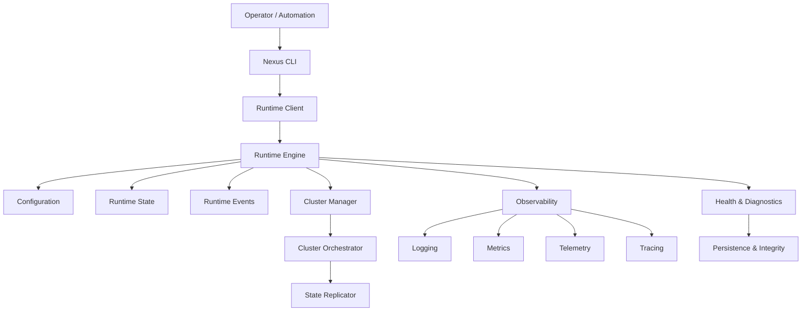
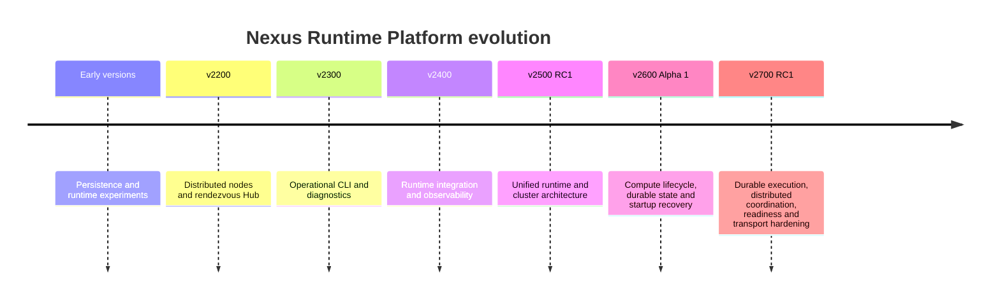

<div align="center">

# Nexus Runtime Platform

### Distributed runtime infrastructure for resilient systems

**Runtime · Cluster · Replication · Diagnostics · Observability**


</div>

---

## Overview

Nexus Runtime Platform is an experimental distributed runtime designed for
research, validation and development of resilient computing infrastructure.

The platform combines runtime lifecycle management, cluster orchestration,
state replication, diagnostics, health inspection and observability through
a modular Python architecture.

> Current release candidate: **v2700.0.0-rc2**

---

## Core capabilities

| Area | Capabilities |
|---|---|
| Runtime | Engine, configuration, state and events |
| Cluster | Node management, orchestration and replication |
| Diagnostics | Local environment and remote runtime inspection |
| Health | Runtime and storage-integrity checks |
| Observability | Logging, metrics, telemetry and tracing |
| CLI | Version, doctor, status, peers and cluster commands |
| Integration | Runtime client and HTTP endpoint client |
| Validation | Automated regression and cross-platform tests |

---

## Executive technical brief

For a concise external overview of the V2700 architecture, demonstrated
resilience evidence, technical boundaries and evaluation path, see the
[Executive Technical Brief](docs/NEXUS_V2700_EXECUTIVE_TECHNICAL_BRIEF.md).
## Physical resilience evidence

V2700 includes a controlled three-node master-loss statistical campaign.

The certified Axis 11 population contains **29 physical samples**:
all **29 converged**, with **0 operational split-brain observations**
under the documented measurement semantics.

The mean measured complete T0-to-T4 failover interval was approximately
**31.49 seconds** in the controlled campaign environment.

See the
[V2700 Resilience Case Study](docs/NEXUS_V2700_RESILIENCE_CASE_STUDY.md)
for methodology, timing statistics, evidence boundaries and
reproducibility details.

---

## External evaluation path

For an external technical evaluation of Nexus V2700:

1. [Executive Technical Brief](docs/NEXUS_V2700_EXECUTIVE_TECHNICAL_BRIEF.md) - architecture, capabilities, boundaries and evidence map.
2. [Resilience Case Study](docs/NEXUS_V2700_RESILIENCE_CASE_STUDY.md) - controlled three-node MASTER-loss scenario.
3. [Technical Positioning](docs/NEXUS_V2700_TECHNICAL_POSITIONING.md) - neutral scope comparison with established distributed-system technologies.
4. [External Resilience Demonstration](docs/NEXUS_V2700_EXTERNAL_RESILIENCE_DEMO.md) - navigation layer over certified resilience evidence.
5. [Axis 11 Statistical Resilience](docs/validation/NEXUS-V2700-AXIS-11-STATISTICAL-RESILIENCE.md) - statistical certification record and methodology.

The Axis 11 campaign contains **29 physical samples (run011-run039)**:
**29 valid, 29 converged, 0 operational split-brain observations, and 29 NODE-C promotions** under the documented experiment contract.

| T0 -> T4 metric | Result |
| --- | ---: |
| Mean | 31492.270 ms |
| Median | 31491.374 ms |
| p95 | 31584.133 ms |
| p99 | 31607.337 ms |
| Minimum | 31367.022 ms |
| Maximum | 31614.804 ms |

`run010` is preserved as incomplete and is not counted as a physical sample. No `run040` was created.

These results apply to the documented experiment contract. They are not production certification, universal fault-tolerance claims, or a direct performance comparison with etcd, Consul, Raft implementations, or other distributed systems.

## Architecture


```mermaid
flowchart TD
    OPERATOR["Operator / Automation"] --> CLI["Nexus CLI"]

    CLI --> CLIENT["Runtime Client"]
    CLIENT --> ENGINE["Runtime Engine"]

    ENGINE --> CONFIG["Configuration"]
    ENGINE --> STATE["Runtime State"]
    ENGINE --> EVENTS["Runtime Events"]

    ENGINE --> CLUSTER["Cluster Manager"]
    CLUSTER --> ORCHESTRATOR["Cluster Orchestrator"]
    ORCHESTRATOR --> REPLICATOR["State Replicator"]

    ENGINE --> HEALTH["Health & Diagnostics"]
    ENGINE --> OBSERVABILITY["Observability"]

    OBSERVABILITY --> LOGGING["Logging"]
    OBSERVABILITY --> METRICS["Metrics"]
    OBSERVABILITY --> TELEMETRY["Telemetry"]
    OBSERVABILITY --> TRACING["Tracing"]

    HEALTH --> STORAGE["Persistence & Integrity"]
```

The architecture is divided into independent layers so runtime, cluster,
diagnostic and observability components can evolve without requiring a
monolithic implementation.

---

## Command-line interface

The `nexus` command provides a unified operational interface.

```text
usage: nexus [-h] {version,status,peers,cluster,doctor} ...

Nexus Runtime Platform CLI
```

Available commands:

| Command | Purpose |
|---|---|
| `nexus version` | Display the installed platform version |
| `nexus doctor` | Diagnose the local environment or a remote runtime |
| `nexus status` | Query the state of a Nexus node |
| `nexus peers` | List peers registered in the Hub |
| `nexus cluster` | Display the cluster summary |

These commands correspond to the CLI currently exposed by the project.

### Version

```powershell
nexus version
```

```text
Nexus Runtime Platform v2700.0.0-rc2
```

### Local diagnostics

```powershell
nexus doctor
```

The doctor command reports:

- CLI and Python versions;
- operating-system information;
- Python executable;
- working-directory permissions;
- optional runtime connectivity;
- runtime health;
- storage integrity;
- cluster leadership and membership.

### Remote diagnostics

```powershell
nexus doctor --url http://127.0.0.1:8081/status
```

### JSON output

```powershell
nexus doctor --json
nexus status --json
nexus cluster --json
nexus peers --json
```

### Continuous monitoring

```powershell
nexus doctor `
    --url http://127.0.0.1:8081/status `
    --watch `
    --interval 2 `
    --clear
```

---

## Quick start

### Requirements

- Python 3.14 or newer
- Git
- PowerShell, Bash or Termux

### Clone the repository

```bash
git clone https://github.com/gutembergpb27/Termux-nexus.git
cd Termux-nexus
```

### Create a virtual environment

Windows PowerShell:

```powershell
python -m venv .venv
.venv\Scripts\Activate.ps1
```

Linux or Termux:

```bash
python -m venv .venv
source .venv/bin/activate
```

### Install for development

```bash
python -m pip install --upgrade pip
python -m pip install -e .
```

### Validate the installation

```bash
nexus version
nexus doctor
python -m pytest -q
```

---

## Package structure

```text
nexus/
├── cli.py
├── client.py
├── exceptions.py
├── runtime_client.py
├── runtime_lifecycle.py
├── runtime_observability.py
│
├── commands/
│   ├── version.py
│   ├── doctor.py
│   ├── status.py
│   ├── peers.py
│   └── cluster.py
│
├── cluster/
│   ├── manager.py
│   ├── orchestrator.py
│   └── replicator.py
│
└── runtime/
    ├── cluster.py
    ├── config.py
    ├── diagnostics.py
    ├── engine.py
    ├── events.py
    ├── health.py
    ├── logger.py
    ├── metrics.py
    ├── state.py
    ├── telemetry.py
    └── tracing.py
```

---

## Runtime endpoints

| Endpoint | Purpose |
|---|---|
| `/status` | Node identity, role and runtime state |
| `/health` | Runtime and storage-integrity health |
| `/cluster` | Leader, followers and cluster membership |
| `/peers` | Peers registered with the rendezvous Hub |

Example:

```powershell
nexus status --url http://127.0.0.1:8081/status
nexus cluster --url http://127.0.0.1:8081/cluster
nexus peers --url http://127.0.0.1:8500/peers
```

---

## Documentation

| Document | Purpose |
| --- | --- |
| [Executive Technical Brief](docs/NEXUS_V2700_EXECUTIVE_TECHNICAL_BRIEF.md) | External technical overview |
| [External Resilience Demonstration](docs/NEXUS_V2700_EXTERNAL_RESILIENCE_DEMO.md) | Entry point to certified resilience evidence |
| [Resilience Case Study](docs/NEXUS_V2700_RESILIENCE_CASE_STUDY.md) | Controlled MASTER-loss case study |
| [Technical Positioning](docs/NEXUS_V2700_TECHNICAL_POSITIONING.md) | Scope and neutral technology positioning |
| [Axis 11 Statistical Resilience](docs/validation/NEXUS-V2700-AXIS-11-STATISTICAL-RESILIENCE.md) | Statistical resilience certification |
| [V2700 Architecture Plan](docs/NEXUS_V2700_ARCHITECTURE_PLAN.md) | Architecture and development axes |
| [V2700 RC2 Release Notes](RELEASE_NOTES_v2700.0.0-rc2.md) | Release-candidate record |
| [v2500 architecture map](docs/NEXUS_V2500_ARCHITECTURE_MAP.md) | Historical architecture reference |

## Release status

### v2700.0.0 RC2

The current public release candidate is **v2700.0.0-rc2**.

V2700 consolidates durable execution semantics, distributed Compute coordination, operational readiness and observability, and authenticated transport with replay protection.

See [RELEASE_NOTES_v2700.0.0-rc2.md](RELEASE_NOTES_v2700.0.0-rc2.md).

The project remains experimental. Published evidence supports the documented contracts and scenarios and is not a general production-readiness certification.

## Development validation

The V2700 certification baseline completed the repository regression suite with:

```text
810 passed, 1 xfailed
```

The resilience evidence is maintained separately from the ordinary regression count. Axis 11 closed with 29 counted physical samples and a derived statistical campaign artifact.

## Project principles

1. Evidence before claims.
2. Explicit technical limitations.
3. Reproducible validation.
4. Modular architecture.
5. Runtime observability.
6. Integrity-aware state management.
7. Incremental evolution with preserved history.

---

## Roadmap


```mermaid
timeline
    title Nexus Runtime Platform evolution
    Early versions : Persistence and runtime experiments
    v2200 : Distributed nodes and rendezvous Hub
    v2300 : Operational CLI and diagnostics
    v2400 : Runtime integration and observability
    v2500 RC1 : Unified runtime and cluster architecture
    v2600 Alpha 1 : Compute lifecycle, durable state and startup recovery
    v2700 RC1 : Durable execution, distributed coordination, readiness and transport hardening
```

Future work may include:

- expanded multi-node testing;
- stronger network-failure simulation;
- improved replication protocols;
- authentication and transport security;
- packaged releases;
- additional operating-system validation;
- formal production-readiness criteria.

---

## Author

**Gutemberg Procopio Barbosa**

Creator and maintainer of the Nexus Runtime Platform.

GitHub: [@gutembergpb27](https://github.com/gutembergpb27)

---

<div align="center">

**Nexus Runtime Platform**

Resilient runtime infrastructure through evidence, modularity and continuous
validation.

</div>

---
